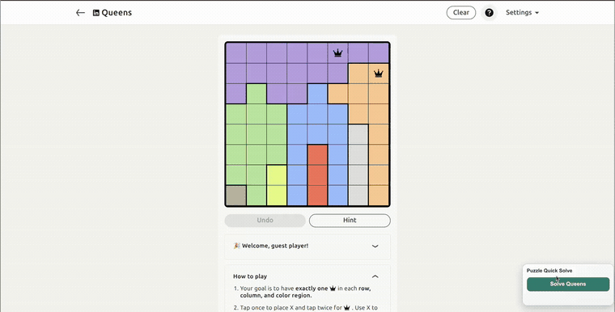
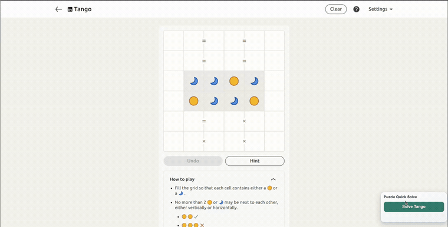
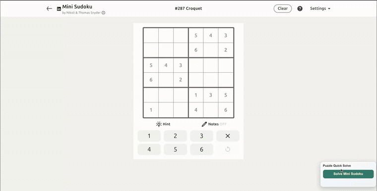
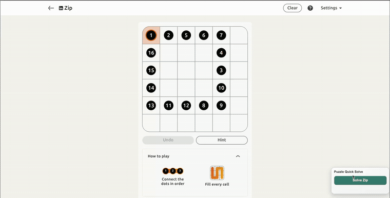
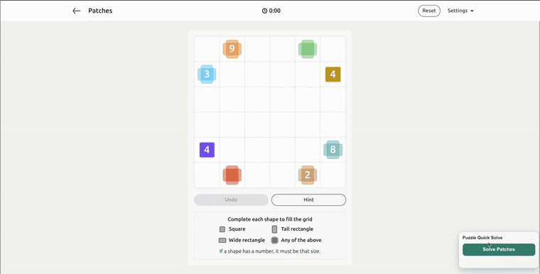
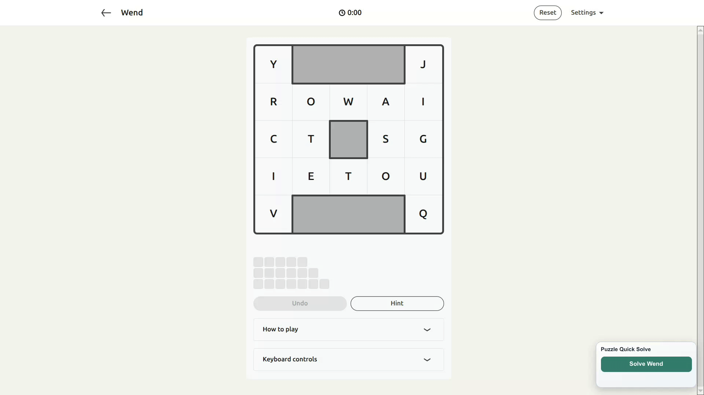

<p align="center">
  
</p>

<h1 align="center">LinkedIn Puzzle Solvers</h1>

<p align="center">
  <strong>Daily LinkedIn puzzles, solved locally.</strong>
  <br>
  Browser extension + FastAPI solver service powered by computer vision and puzzle-specific automation.
</p>

<p align="center">
  <a href="https://github.com/santipvz/linkedin-puzzle-solvers/actions/workflows/ci.yml"></a>
  
  
  
  
</p>

<p align="center">
  <a href="https://github.com/santipvz/linkedin-puzzle-solvers/stargazers"></a>
  <a href="https://github.com/santipvz/linkedin-puzzle-solvers/fork"></a>
  <a href="https://github.com/santipvz/linkedin-puzzle-solvers/issues"></a>
  <a href="https://github.com/santipvz/linkedin-puzzle-solvers/pulls"></a>
</p>

<p align="center">
  
  
  
  
  
  
</p>

<p align="center">
  
</p>

## Demo Gallery

<table border="0" cellspacing="0" cellpadding="0">
  <tr>
    <td width="50%">
      <h3 align="center">Queens</h3>
      
    </td>
    <td width="50%">
      <h3 align="center">Tango</h3>
      
    </td>
  </tr>
  <tr>
    <td width="50%">
      <h3 align="center">Mini Sudoku</h3>
      
    </td>
    <td width="50%">
      <h3 align="center">Zip</h3>
      
    </td>
  </tr>
  <tr>
    <td width="50%">
      <h3 align="center">Patches</h3>
      
    </td>
    <td width="50%">
      <h3 align="center">Wend</h3>
      
    </td>
  </tr>
</table>

<p align="center">
  
</p>


## Quick Start

### 1. Start the API

```bash
python3 -m venv .venv
source .venv/bin/activate
pip install -r requirements.txt

cd services/solver_api
uvicorn app.main:app --reload --host 127.0.0.1 --port 8000
```

Check it is running:

```bash
curl http://127.0.0.1:8000/health
```

Prefer Docker? Use `deploy/local/README.md`. Docker exposes the API at `http://127.0.0.1:18000`.

### 2. Load the extension

Chrome / Chromium:

1. Open `chrome://extensions`.
2. Enable `Developer mode`.
3. Click `Load unpacked`.
4. Select `extension/`.

Firefox:

1. Open `about:debugging#/runtime/this-firefox`.
2. Click `Load Temporary Add-on`.
3. Select `extension/manifest.json`.

### 3. Solve a puzzle

1. Open a supported LinkedIn game page.
2. Click the extension icon.
3. Set the API URL to `http://127.0.0.1:8000`.
4. Use `Auto Detect`, `Solve`, `Apply`, or `Solve + Apply`.

Supported URLs:

- `https://www.linkedin.com/games/queens/`
- `https://www.linkedin.com/games/tango/`
- `https://www.linkedin.com/games/mini-sudoku/`
- `https://www.linkedin.com/games/zip/`
- `https://www.linkedin.com/games/patches/`
- `https://www.linkedin.com/games/wend/`

## How It Works

The extension captures the board image, sends it to the local FastAPI service, and receives a normalized solution. The API routes the image to the matching puzzle worker, where computer vision parses the board and the solver returns the moves.

```text
LinkedIn page -> browser extension -> local API -> puzzle worker -> overlay/apply
```

Main folders:

- `extension/`: browser extension UI, capture, overlay, and auto-apply logic.
- `services/solver_api/`: FastAPI app and puzzle worker routing.
- `games/*_solver/`: puzzle-specific parsers and solvers.
- `core/`: shared computer-vision helpers.
- `deploy/local/`: Docker Compose setup.
- `docs/`: architecture and release notes.

## Useful Commands

```bash
# Run all quality checks
python3 scripts/quality_check.py

# Run API tests
python3 -m unittest discover -s services/solver_api/tests -p "test_*.py"

# Run unit and integration tests
python3 -m pytest

# Check extension JavaScript syntax
node --check extension/background.js
node --check extension/content.js
node --check extension/popup.js
```

## More Docs

- Extension setup and troubleshooting: `extension/README.md`
- API details: `services/solver_api/README.md`
- Docker deployment: `deploy/local/README.md`
- Architecture notes: `docs/architecture.md`
- Wend solver details: `games/wend_solver/README.md`
- Contributing: `CONTRIBUTING.md`

## License

MIT. See `LICENSE`.
