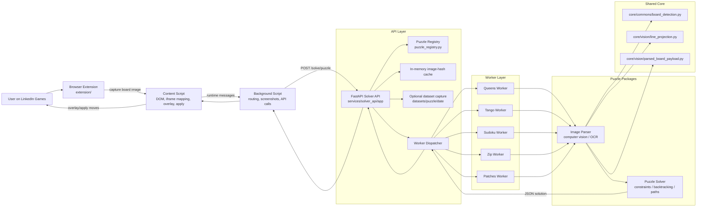

# LinkedIn Puzzle Solvers

[](https://github.com/santipvz/linkedin-puzzle-solvers/actions/workflows/ci.yml)

Computer-vision solvers and browser automation for LinkedIn daily puzzles.

The project is a Python + browser-extension monorepo. The extension captures the active LinkedIn puzzle board, sends it to a local FastAPI service, receives a normalized solution, previews it, and can apply the moves back into the page.

Supported puzzles:

- Queens
- Tango
- Mini Sudoku
- Zip
- Patches

## Quick Start

### 1. Start The Solver API

Development mode:

```bash
python3 -m venv .venv
source .venv/bin/activate
pip install -r requirements.txt

cd services/solver_api
uvicorn app.main:app --reload --host 127.0.0.1 --port 8000
```

Health check:

```bash
curl http://127.0.0.1:8000/health
```

Docker mode:

```bash
cd deploy/local
cp .env.example .env
mkdir -p ../../datasets
docker compose up -d --build
curl http://127.0.0.1:18000/health
```

Use `http://127.0.0.1:8000` for local Uvicorn or `http://127.0.0.1:18000` for Docker.

### 2. Load The Browser Extension

Chrome / Chromium:

1. Open `chrome://extensions`.
2. Enable `Developer mode`.
3. Click `Load unpacked`.
4. Select `extension/`.

Firefox temporary install:

1. Open `about:debugging#/runtime/this-firefox`.
2. Click `Load Temporary Add-on`.
3. Select `extension/manifest.json`.

### 3. Solve A Puzzle

1. Open a supported LinkedIn puzzle page.
2. Click the extension icon and set the API URL.
3. Use `Auto Detect`, `Solve`, `Apply`, or `Solve + Apply`.
4. Or use the in-page quick widget: `Solve <Puzzle>`.

Supported URLs:

- `https://www.linkedin.com/games/queens/`
- `https://www.linkedin.com/games/tango/`
- `https://www.linkedin.com/games/mini-sudoku/`
- `https://www.linkedin.com/games/zip/`
- `https://www.linkedin.com/games/patches/`

## Architecture



## Repository Layout

- `extension/`: browser extension UI and automation.
- `services/solver_api/`: FastAPI app, puzzle registry, solve endpoints, worker execution, caching, dataset capture.
- `services/solver_api/app/workers/`: one worker per puzzle; each worker normalizes parser/solver output into the API response contract.
- `games/queen_solver/`: Queens image parser and solver.
- `games/tango_solver/`: Tango image parser, constraint detection, solver, and tests.
- `games/sudoku_solver/`: Mini Sudoku parser and solver.
- `games/zip_solver/`: Zip parser and path solver.
- `games/patches_solver/`: Patches parser/OCR and rectangle-tiling solver.
- `core/`: shared board-detection, line-projection, and parser payload helpers.
- `scripts/`: smoke checks, registry sync checks, and dataset benchmarks.
- `deploy/local/`: Docker Compose deployment for a persistent local API service.
- `docs/`: architecture, release, and refactor notes.
- `datasets/`: generated local captures, ignored by git.

## Runtime Flow

1. The extension detects the puzzle type from the page URL or iframe URL.
2. The extension captures the board or selected region as an image.
3. The background script calls `POST /solve/<puzzle>` with multipart field `image`.
4. The API hashes the image and uses an in-memory cache when possible.
5. The selected worker loads the puzzle package, parses the board image, and runs the solver.
6. The worker returns a stable JSON payload: puzzle name, solved status, board size, moves, solution grid, clues, errors, and details.
7. The extension renders an overlay and optionally applies the solution through DOM/click/keyboard/drag automation.

## API

Health:

```bash
curl http://127.0.0.1:8000/health
```

Solve endpoints:

- `POST /solve/queens`
- `POST /solve/tango`
- `POST /solve/sudoku`
- `POST /solve/zip`
- `POST /solve/patches`

All solve endpoints accept multipart form data with field name `image`.

Example:

```bash
curl -X POST \
  -F "image=@games/tango_solver/examples/sample1.png" \
  http://127.0.0.1:8000/solve/tango
```

## Local Commands

Install dependencies:

```bash
python3 -m venv .venv
source .venv/bin/activate
pip install -r requirements-dev.txt
```

Run all local quality checks:

```bash
python3 scripts/quality_check.py
```

Run API in development:

```bash
cd services/solver_api
uvicorn app.main:app --reload --host 127.0.0.1 --port 8000
```

Run Docker service:

```bash
cd deploy/local
docker compose up -d --build
docker compose logs -f solver-api
```

Run smoke checks:

```bash
python3 scripts/check_puzzle_registry_sync.py
python3 -m unittest discover -s services/solver_api/tests -p "test_*.py"
python3 scripts/smoke_check.py
```

Run puzzle tests:

```bash
python3 -m pytest games/queen_solver/tests games/tango_solver/tests games/patches_solver/tests
```

Check extension JavaScript syntax:

```bash
node --check extension/background.js
node --check extension/content.js
node --check extension/popup.js
```

Compile Python modules:

```bash
python3 -m compileall services/solver_api/app games/*_solver/src core scripts
```

## Dataset Capture

The API can archive start-board screenshots for debugging and regression data.

- Default path: `datasets/<puzzle>/<YYYY-MM-DD>/`.
- Capture is enabled by default with `DATASET_CAPTURE_ENABLED=1`.
- Disable capture with `DATASET_CAPTURE_ENABLED=0`.
- Docker capture paths are configured in `deploy/local/.env`.
- Generated datasets are ignored by git.

If files under `datasets/` are owned by `root`, fix them from the repo root:

```bash
sudo chown -R "$USER:$USER" datasets
chmod -R u+rwX,go+rX datasets
```

## Troubleshooting

- API does not respond: check `curl http://127.0.0.1:8000/health` or Docker port `18000`.
- Extension cannot connect: verify the configured API URL in the popup.
- Puzzle solves but applies incorrectly: use preview overlay first, then inspect parser details in the API response.
- Patches OCR looks wrong: check `clue_count`, `numbered_clue_count`, `recovered_clues`, and `parse_reliable` in response details.
- Dataset files cannot be deleted: fix ownership with the `chown` command in the Dataset Capture section.

## More Documentation

- `extension/README.md`: browser extension usage.
- `services/solver_api/README.md`: API-specific usage.
- `deploy/local/README.md`: Docker deployment operations.
- `docs/architecture.md`: deeper architecture notes.
- `docs/release.md`: release checklist.
- `CONTRIBUTING.md`: contribution guidelines.

## License

MIT. See `LICENSE`.
