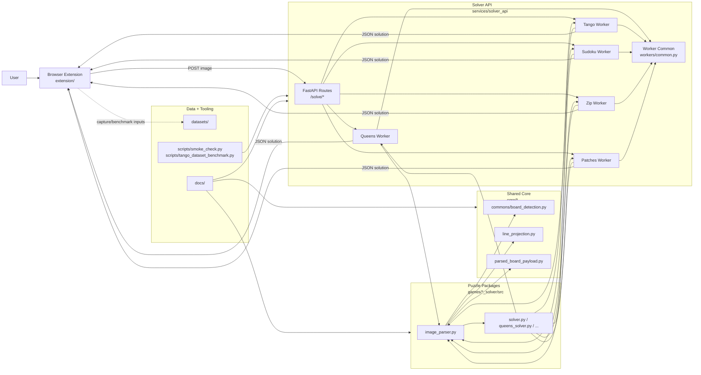

# Architecture Overview

This document describes the current end-to-end architecture after the modularization and decoupling passes.

## Design Goals

- Keep puzzle-specific heuristics inside each solver package.
- Move puzzle-agnostic logic to shared modules.
- Keep API contracts stable while refactoring internals.
- Validate every refactor with compile, tests, smoke checks, and dataset benchmarks.

## Layered Architecture

- Client layer:
  - Browser extension (`extension/`) captures board screenshots, calls API, previews moves, applies moves.
- API layer:
  - FastAPI service (`services/solver_api/app`) routes `/solve/<puzzle>` requests.
- Worker orchestration layer:
  - Per-puzzle workers in `services/solver_api/app/workers` orchestrate parse -> solve -> response.
  - Shared worker helpers in `services/solver_api/app/workers/common.py` provide runtime bootstrap and normalized utilities.
- Solver packages:
  - `games/*_solver/src/image_parser.py` parses board state from image.
  - `games/*_solver/src/*solver*.py` computes solution/moves.
- Shared core modules:
  - `core/commons/board_detection.py` for deterministic board and grid detection.
  - `core/vision/line_projection.py` for projection/line grouping helpers.
  - `core/vision/parsed_board_payload.py` for common parser metadata payload construction.
- Data and operations:
  - `datasets/` stores captured datasets.
  - `scripts/` runs smoke checks and benchmarks.
  - `docs/` stores release and architecture documentation.

## End-to-End Flow

1. Extension captures the active puzzle board image.
2. Extension sends image to the solver API endpoint for the detected puzzle type.
3. API dispatches to the corresponding worker.
4. Worker activates the puzzle import context and calls the puzzle parser.
5. Parser uses shared core vision helpers where applicable and emits normalized metadata.
6. Worker calls the puzzle solver and shapes a stable API response.
7. Extension receives moves/solution grid and applies them in the page UI.

## Architecture Diagram

## Current Decoupling Status

- Shared parser metadata payload builder is used by Sudoku, Zip, Patches, and Tango parsers.
- Worker-side shared helpers centralize board-size inference and grid normalization.
- Puzzle-specific OCR and solving logic remains isolated per game package.
